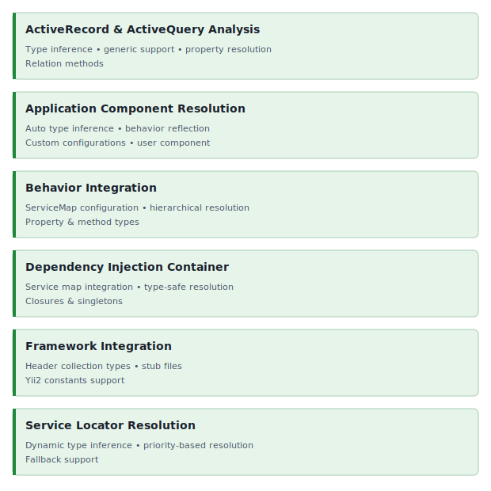

<!-- markdownlint-disable MD041 -->
<p align="center">
    <picture>
        <source media="(prefers-color-scheme: dark)" srcset="https://www.yiiframework.com/image/design/logo/yii3_full_for_dark.svg">
        <source media="(prefers-color-scheme: light)" srcset="https://www.yiiframework.com/image/design/logo/yii3_full_for_light.svg">
        
    </picture>
    <h1 align="center">PHPStan</h1>
    <br>
</p>
<!-- markdownlint-enable MD041 -->

<p align="center">
    <a href="https://github.com/yii2-extensions/phpstan/actions/workflows/build.yml" target="_blank">
        
    </a>
    <a href="https://github.com/yii2-extensions/phpstan/actions/workflows/static.yml" target="_blank">
        
    </a>
</p>

<p align="center">
    <strong>Enhanced static analysis for Yii2 applications with PHPStan</strong><br>
    <em>Precise type inference, dynamic method resolution, and comprehensive property reflection</em>
</p>

## Features

<picture>
    <source media="(min-width: 768px)" srcset="./docs/svgs/features.svg">
    
</picture>

### Installation

```bash
composer require --dev yii2-extensions/phpstan:^0.4
```

### Quick start

Create a `phpstan.neon` file in your project root.

```neon
includes:
    - vendor/yii2-extensions/phpstan/extension.neon

parameters:
    level: 5

    paths:
        - src
        - controllers
        - models

    tmpDir: %currentWorkingDirectory%/runtime

    yii2:
        config_path: config/phpstan-config.php
        component_generics:
            user: identityClass      # Built-in (already configured)
            repository: modelClass   # Custom generic component
```

Create a PHPStan-specific config file (`config/phpstan-config.php`).

```php
<?php

declare(strict_types=1);

return [
    // Application params: enables precise type inference for Yii::$app->params
    'params' => [
        'turnstile.siteKey' => '',
        'adminEmail' => 'admin@example.com',
        'maxItems' => 100,
    ],
    // PHPStan only: used by this extension for behavior property/method type inference
    'behaviors' => [
        app\models\User::class => [
            app\behaviors\SoftDeleteBehavior::class,
            yii\behaviors\TimestampBehavior::class,
        ],
    ],
    'components' => [
        'db' => [
            'class' => yii\db\Connection::class,
            'dsn' => 'sqlite::memory:',
        ],
        'user' => [
            'class' => yii\web\User::class,
            'identityClass' => app\models\User::class,
        ],
        // Add your custom components here
    ],
];
```

Run `PHPStan`.

```bash
vendor/bin/phpstan analyse
```

### Type inference examples

#### Active Record

```php
// ✅ Typed as User|null
$user = User::findOne(1);

// ✅ Typed as User[]
$users = User::findAll(['status' => 'active']);

// ✅ Generic ActiveQuery<User> with method chaining
$query = User::find()->where(['active' => 1])->orderBy('name');

// ✅ Array results typed as array{id: int, name: string}[]
$userData = User::find()->asArray()->all();

// ✅ Typed based on model property annotations string
$userName = $user->getAttribute('name');

// ✅ Behavior property resolution string
$slug = $user->getAttribute('slug');
```

#### Application components

```php
// ✅ Typed based on your configuration
$mailer = Yii::$app->mailer; // MailerInterface
$db = Yii::$app->db;         // Connection
$user = Yii::$app->user;     // User

// ✅ User identity with proper type inference
if (Yii::$app->user->isGuest === false) {
    $userId = Yii::$app->user->id;           // int|string|null
    $identity = Yii::$app->user->identity;   // YourUserClass
}
```

#### Application params

```php
// Types are inferred from the values in your phpstan-config.php 'params' key

// ✅ Typed as array{'turnstile.siteKey': string, adminEmail: string, maxItems: int}
$params = Yii::$app->params;

// ✅ Typed as string
$email = Yii::$app->params['adminEmail'];

// ✅ Typed as int
$maxItems = Yii::$app->params['maxItems'];

// ✅ Nested arrays are also supported
// 'nested' => ['db' => ['host' => 'localhost', 'port' => 3306]]
$host = Yii::$app->params['nested']['db']['host']; // string
```

#### Behaviors

```php
// Behaviors are attached via the `phpstan-config.php` behaviors map (PHPStan only)

/**
 * @property string $slug
 * @property-read int $created_at
 *
 * Note: `created_at` is provided by `TimestampBehavior`.
 */
class SoftDeleteBehavior extends \yii\base\Behavior
{
    public function softDelete(): bool { /* ... */ }
}

// ✅ Typed based on your configuration
$user = new User();

// ✅ Typed as string (inferred from behavior property)
$slug = $user->getAttribute('slug');

// ✅ Direct property access is also inferred (behavior property)
$slug2 = $user->slug;

// ✅ Typed as int (inferred from behavior property)
$createdAt = $user->getAttribute('created_at');

// ✅ Typed as bool (method defined in attached behavior)
$result = $user->softDelete();
```

#### Dependency injection

```php
$container = new Container();

// ✅ Type-safe service resolution
$service = $container->get(MyService::class); // MyService
$logger = $container->get('logger');          // LoggerInterface (if configured) or mixed
```

#### Header collection

```php
$headers = new HeaderCollection();

// ✅ Typed as string|null
$host = $headers->get('Host');

// ✅ Typed as array<int, string>
$forwardedFor = $headers->get('X-Forwarded-For', ['127.0.0.1'], false);

// ✅ Dynamic return type inference with mixed default
$default = 'default-value';
$requestId = $headers->get('X-Request-ID', $default, true); // string|null
$allRequestIds = $headers->get('X-Request-ID', [$default], false); // array<int, string>|null
```

#### Service locator

```php
$serviceLocator = new ServiceLocator();

// ✅ Get component with type inference with class
$mailer = $serviceLocator->get(Mailer::class);  // MailerInterface

// ✅ Get component with string identifier and without configuration in ServiceMap
$mailer = $serviceLocator->get('mailer');  // MailerInterface (if configured) or mixed

// ✅ User component with proper type inference in Action or Controller
$user = $this->controller->module->get('user'); // UserInterface
```

## Documentation

For detailed configuration options and advanced usage.

- 📚 [Installation Guide](docs/installation.md)
- ⚙️ [Configuration Reference](docs/configuration.md)
- 💡 [Usage Examples](docs/examples.md)
- 🧪 [Testing Guide](docs/testing.md)

## Package information

[](https://www.php.net/releases/8.1/en.php)
[](https://packagist.org/packages/yiisoft/yii2)
[](https://github.com/yiisoft/yii2/tree/22.0)
[](https://packagist.org/packages/yii2-extensions/phpstan)
[](https://packagist.org/packages/yii2-extensions/phpstan)

## Our social networks

[](https://x.com/Terabytesoftw)
[](https://www.facebook.com/wilmer.arambula.9)
[](https://www.reddit.com/r/Yii2/)
[](https://t.me/yii_framework_in_english)

## License

[](LICENSE)
